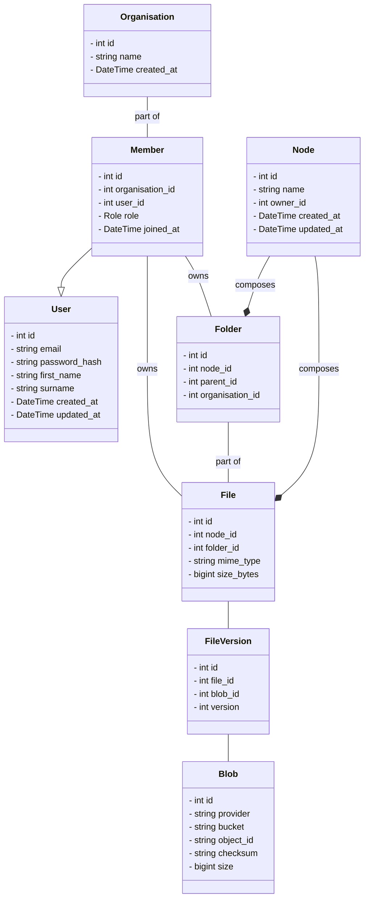
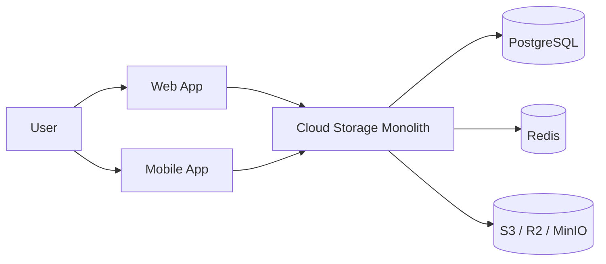

# AirBox

- [AirBox](#airbox)
  - [Context](#context)
  - [Goals](#goals)
  - [Out Of Scope](#out-of-scope)
  - [Assumptions](#assumptions)
  - [Functional Requirements](#functional-requirements)
  - [Non-Functional Requirements](#non-functional-requirements)
    - [Reliability](#reliability)
    - [Durability](#durability)
    - [Performance](#performance)
    - [Security](#security)
    - [Scalability](#scalability)
    - [Maintainability](#maintainability)
    - [Observability](#observability)
  - [Domain Models](#domain-models)
  - [Architecture Overview](#architecture-overview)
  - [API Design](#api-design)
  - [Package Design](#package-design)

## Context

Build a minimal cloud file hosting and sharing platform, borrowing inspiration from Box.com and Dropbox.

## Goals

- Store files securely
- Organize files into folders
- Maintain file version history

## Out Of Scope

- Real-time document collaboration
- Video streaming
- Enterprise compliance features
- Multi-region deployment

## Assumptions

- Object storage provides durability.
- Users own all uploaded content.
- Uploads larger than 5 GB are out of scope.

## Functional Requirements

- A user must be able to :-
  - register
  - login
  - create folders
  - upload files
  - download files
  - delete files
  - move files
  - rename files

## Non-Functional Requirements

### Reliability

- Metadata operations must be transactional.
- File uploads should be recoverable from failures.

### Durability

- File content stored in object storage.
- Daily PostgreSQL backups.
- Support immutable file versions.

### Performance

- Folder listing < 200ms.
- Metadata lookup < 100ms.
- Upload initialization < 200ms.

### Security

- Passwords hashed using Argon2 or bcrypt.
- Private object storage buckets.
- Signed URLs for downloads.
- Authorization enforced on every resource.

### Scalability

- Support 10,000 users.
- Support 1,000,000 files.
- Support files up to 5GB.

### Maintainability

- Modular monolith architecture.
- Clear domain boundaries.
- Automated tests for core workflows.

### Observability

- Structured logs.
- Request tracing IDs.
- Error monitoring.

## Domain Models



## Architecture Overview



## API Design

```text
POST   /auth/login

GET    /files/{id}
POST   /files
DELETE /files/{id}

POST   /folders
```

## Package Design

```text
apps/
  iam/
  filesystem/
  storage/
```
